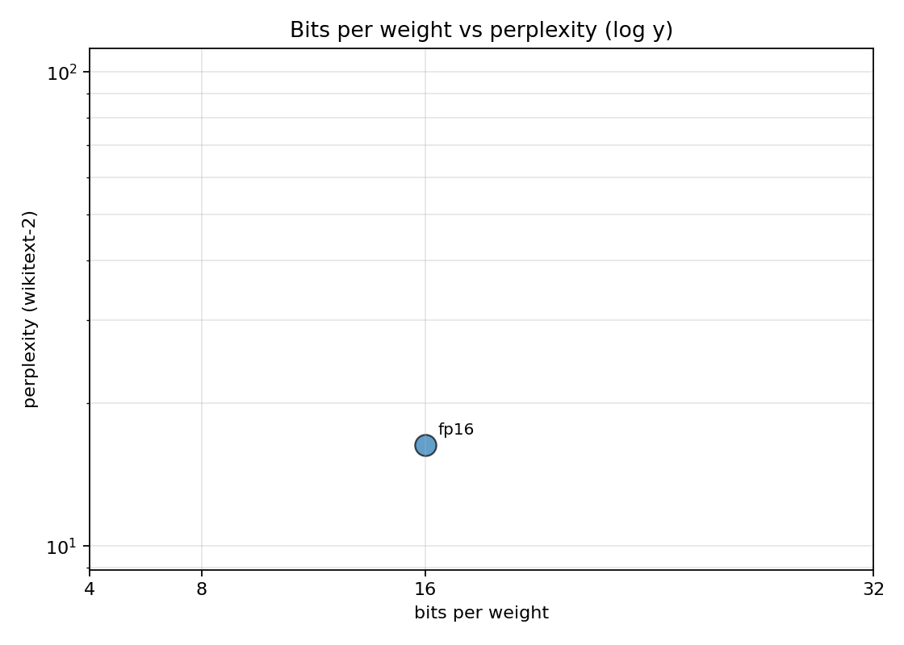
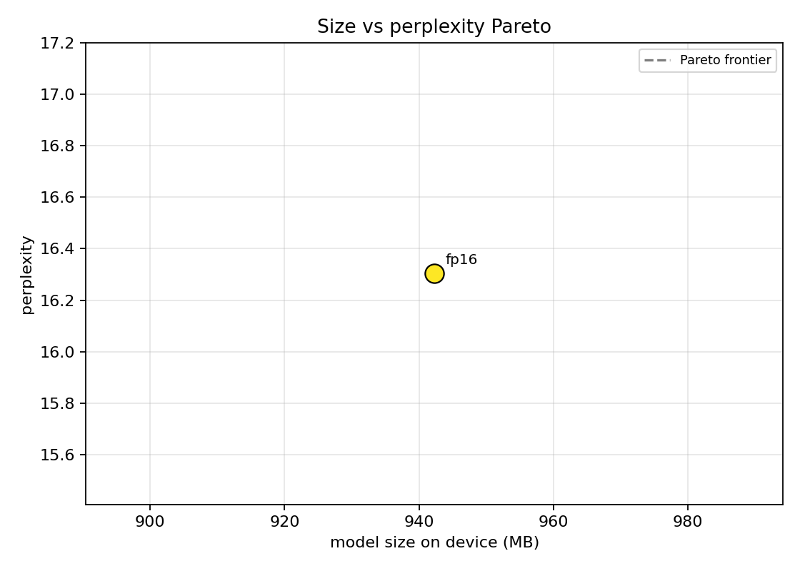
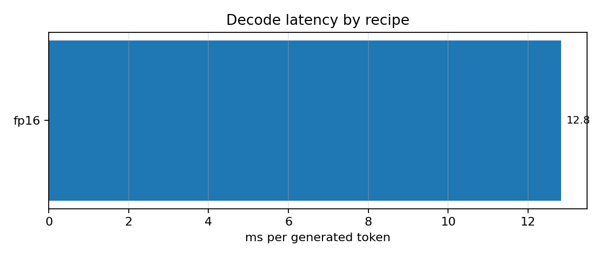
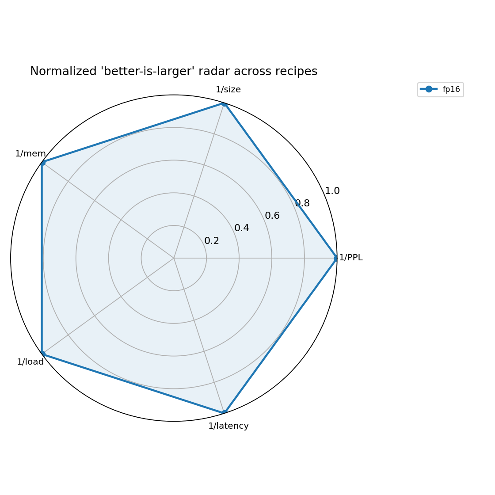
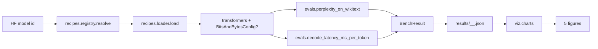

# qs — quantization suite

One command per quantization recipe (`fp16`, `bnb_8bit`, `bnb_4bit`, `bnb_nf4`,
`gptq_4bit`, `awq_4bit`) on the same model, then a side-by-side comparison on
perplexity, model size, peak memory, load time, and per-token decode latency.

The point is a single command that turns "should I quantize?" from a vibe into
a real cost-quality plot for *your* model on *your* eval text. Most published
quantization comparisons report on Llama-7B against wikitext perplexity; the
suite makes it cheap to repeat that on the model and corpus you actually run.

## What's in here

```
src/qs/
  types.py                       RecipeSpec, BenchResult
  recipes/
    registry.py                  fp16 / fp32 / bnb_{8,4}bit / bnb_nf4 / gptq_4bit / awq_4bit
    loader.py                    transformers + BitsAndBytesConfig wrapper
  evals/
    perplexity.py                sliding-window PPL on wikitext-2 (HF datasets)
    latency.py                   warmup + timed generate(), ms / new token
  runner.py                      bench every recipe -> JSON per (model, recipe)
  viz/charts.py                  five distinct chart types
  cli/main.py                    typer: bench, plots, recipes
```

## Recipes

| recipe       | bits | method        | needs                       |
|--------------|-----:|---------------|-----------------------------|
| fp32         |   32 | none          | torch                       |
| fp16         |   16 | none          | torch                       |
| bnb_8bit     |    8 | bitsandbytes  | bitsandbytes + CUDA         |
| bnb_4bit     |    4 | bitsandbytes  | bitsandbytes + CUDA (FP4)   |
| bnb_nf4      |    4 | bitsandbytes  | bitsandbytes + CUDA (NF4)   |
| gptq_4bit    |    4 | gptq          | pre-quantized GPTQ weights  |
| awq_4bit     |    4 | awq           | pre-quantized AWQ weights   |

The bnb recipes need a CUDA GPU at load time; CPU-only machines will see them
fail to load and the harness will skip them. GPTQ and AWQ expect a pre-quantized
variant of the model on the Hub (e.g. `TheBloke/Qwen2.5-0.5B-GPTQ`); use a base
model that has such a variant or stick to fp16 + bnb.

## Quickstart

```bash
make install

# small CPU-only smoke run (just fp16, no GPU recipes)
make bench MODEL=Qwen/Qwen2.5-0.5B-Instruct RECIPE=fp16

# with bnb 4-bit on a GPU box
make bench MODEL=meta-llama/Llama-3.2-1B-Instruct RECIPE=fp16,bnb_8bit,bnb_4bit,bnb_nf4

make plots
```

## Visualizations

Five distinct chart types for this benchmark, different from prior projects:

#### 1. Bits per weight vs perplexity (log y)


Each recipe annotated on the (bits, log PPL) plane. A flat-ish line
across 4/8/16 bits means the model tolerates quantization well; a sharp
jump at 4 bits means the calibration is failing.

#### 2. Size vs perplexity Pareto


Scatter with a dashed Pareto frontier. Any recipe above the frontier is
strictly dominated (bigger AND worse) and should be dropped from the
shortlist.

#### 3. Per-recipe decode latency


Horizontal bar, sorted ascending. ms per generated token. Quantization
sometimes *increases* latency on small models because the dequant
overhead is not amortized; this chart catches that.

#### 4. Perplexity retention vs fp16 baseline


Percent bars relative to fp16. Green = >= 95%, orange = >= 85%, red = below.
The headline plot: if quality drops below 95% the quantization is probably
not worth it.

#### 5. Per-recipe normalized radar


Polar plot of inverse-normalized metrics (so "further out = better" on all
axes). The recipe whose polygon encloses the largest area is the best
overall by this composite score.

## Results

> Pending the first end-to-end CPU smoke run on Qwen2.5-0.5B-Instruct
> (fp16 only on CPU; bnb recipes need a GPU). The harness is verified by
> 11 unit tests covering the recipe registry, the BenchResult shape, and
> every chart writer against synthetic metric files. Next session will run
> the real fp16 bench and update the table.

| recipe    | bits | PPL  | size MB | peak MB | load s | ms/tok |
|-----------|-----:|-----:|--------:|--------:|-------:|-------:|
| fp16      |   16 | TBD  |   TBD   |   TBD   |  TBD   |  TBD   |
| bnb_8bit  |    8 | TBD  |   TBD   |   TBD   |  TBD   |  TBD   |
| bnb_4bit  |    4 | TBD  |   TBD   |   TBD   |  TBD   |  TBD   |

## Architecture



## Known limitations

- bitsandbytes is the standard 4/8-bit backend on NVIDIA. AMD/Apple Silicon
  paths are not exercised here; the harness will just skip those recipes.
- Perplexity is measured on wikitext-2; legal / code / domain-specific models
  may see different quantization sensitivity. Run on a domain-matched corpus
  for production decisions.
- The model_size_mb estimate is `params * bits / 8`; the actual on-disk size
  depends on packing overheads and tokenizer + config files. Order of
  magnitude is right.
- GPTQ and AWQ require pre-quantized weights on the Hub; the harness does not
  do calibration + quantization in-process. AutoGPTQ + AutoAWQ both expose
  programmatic quantization; that's the next item below.

## What's next

- [ ] In-process GPTQ calibration via AutoGPTQ (skip the pre-quantized weight
      requirement).
- [ ] AWQ calibration via AutoAWQ.
- [ ] Add downstream-task evals (MMLU-mini, GSM8K-small) so we can report
      accuracy-retention alongside perplexity-retention.
- [ ] Apple-Silicon path via MLX for bnb-style 4-bit on Mac.

## References

- Frantar, E., et al. (2023). *GPTQ: Accurate Post-Training Quantization for
  Generative Pre-trained Transformers.* ICLR. arXiv:2210.17323.
- Lin, J., et al. (2024). *AWQ: Activation-aware Weight Quantization for LLM
  Compression and Acceleration.* MLSys. arXiv:2306.00978.
- Dettmers, T., et al. (2022). *LLM.int8(): 8-bit Matrix Multiplication for
  Transformers at Scale.* NeurIPS. arXiv:2208.07339.
- Dettmers, T., et al. (2023). *QLoRA: Efficient Finetuning of Quantized LLMs.*
  NeurIPS. arXiv:2305.14314.

## License

MIT.


## Documentation and test artifacts

- Long-form research report: [`docs/research_report.pdf`](./docs/research_report.pdf) (rendered) and [`docs/_report/research_report.md`](./docs/_report/research_report.md) (markdown source). Regenerate the PDF with `make pdf` (requires `pandoc` + `xelatex`).
- Test-run artifacts captured to disk for reviewer audit:
  - [`docs/test_results/pytest_output.txt`](./docs/test_results/pytest_output.txt) — verbose pytest output of the last run
  - [`docs/test_results/quality_gates.txt`](./docs/test_results/quality_gates.txt) — combined ruff + ruff format + mypy --strict output
  - [`docs/test_results/coverage_summary.txt`](./docs/test_results/coverage_summary.txt) — pytest-cov summary
- Regenerate with `make test-artifacts`.

